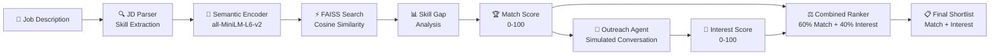

# 🤖 AI-Powered Talent Scouting & Engagement Agent

An intelligent agent that takes a **Job Description** as input, discovers matching candidates, **engages them conversationally** to assess genuine interest, and outputs a **ranked shortlist** scored on two dimensions: **Match Score** and **Interest Score**.

---

## ✨ Features

| Feature | Detail |
|---|---|
| **JD Parsing** | Extracts 60+ canonical skills from job descriptions using keyword NLP |
| **Semantic Matching** | `all-MiniLM-L6-v2` sentence-transformer + FAISS cosine similarity |
| **Skill Gap Analysis** | Compares JD skills against candidate profiles → matched & missing skills |
| **Conversational Outreach** | AI agent simulates personalized 6-message recruiter–candidate conversations |
| **Interest Scoring** | 4-dimensional assessment: enthusiasm, availability, role alignment, engagement |
| **Combined Ranking** | Final Score = 60% Match + 40% Interest → recruiter-ready shortlist |
| **Explainability** | Auto-generated reasons + full conversation transcripts for every candidate |
| **React UI** | Modern dark-themed frontend with pipeline visualization and chat panels |
| **Fully Local** | No paid APIs — runs entirely on open-source models |

---

## 🏛️ Architecture



### Pipeline Stages

| Stage | Module | Description |
|---|---|---|
| 1. **JD Parsing** | `analyzer.py` | Extract canonical skills from free-text job description |
| 2. **Semantic Search** | `embeddings.py` + `matcher.py` | Encode JD → FAISS vector search → top candidates |
| 3. **Skill Gap Analysis** | `analyzer.py` | Compare JD skills vs. candidate skills → overlap score |
| 4. **Match Scoring** | `matcher.py` | 60% semantic + 35% skill overlap + 5% experience → Match Score |
| 5. **Conversational Outreach** | `outreach.py` | Simulate personalized 6-message conversations per candidate |
| 6. **Interest Assessment** | `outreach.py` | Score enthusiasm, availability, alignment, engagement |
| 7. **Combined Ranking** | `main.py` | Final Score = 0.6 × Match + 0.4 × Interest → re-rank |

---

## 🏗️ Project Structure

```
ai_hiring_agent/
│
├── app/                        # Backend source package
│   ├── __init__.py
│   ├── main.py                 # FastAPI routes (/match, /pipeline, /health)
│   ├── matcher.py              # FAISS index + matching engine
│   ├── embeddings.py           # Sentence-transformer wrapper + caching
│   ├── analyzer.py             # Skill extraction + gap analysis
│   ├── outreach.py             # Conversational outreach simulation
│   └── models.py               # Pydantic schemas (request/response)
│
├── frontend/                   # React UI (Vite + Tailwind CSS)
│   ├── src/
│   │   ├── components/
│   │   │   ├── JobInput.jsx          # JD textarea + submit
│   │   │   ├── CandidateCard.jsx     # Dual-score card + conversation toggle
│   │   │   ├── ConversationPanel.jsx # Chat-style outreach display
│   │   │   ├── PipelineSteps.jsx     # Pipeline stage indicator
│   │   │   ├── ResultsList.jsx       # Ranked results with stats
│   │   │   └── Loader.jsx            # Stage-aware loading spinner
│   │   ├── App.jsx                   # Root orchestrator
│   │   ├── api.js                    # Axios client
│   │   └── index.css                 # Tailwind v4 theme
│   ├── index.html
│   ├── vite.config.js
│   └── package.json
│
├── data/
│   └── candidates.json         # 20 realistic candidate profiles
│
├── tests/
│   ├── __init__.py
│   └── test_analyzer.py
│
├── .env.example
├── .gitignore
├── pyproject.toml
├── requirements.txt
└── README.md
```

---

## ⚙️ Tech Stack

| Layer | Technology |
|---|---|
| Backend API | FastAPI + Uvicorn |
| Embeddings | `sentence-transformers` — `all-MiniLM-L6-v2` |
| Vector search | FAISS (`IndexFlatIP`) |
| ML framework | PyTorch (CPU) |
| Outreach simulation | Rule-based deterministic engine |
| Frontend | React (Vite) + Tailwind CSS v4 + Axios |
| Schema validation | Pydantic v2 |
| Data storage | Local JSON |
| Testing | Pytest |

---

## 🚀 Setup & Installation

### 1 — Clone / enter the project

```bash
cd ai_hiring_agent
```

### 2 — Backend setup

```bash
# Create & activate virtual environment
python -m venv .venv

# Windows (PowerShell):
.venv\Scripts\Activate.ps1
# macOS / Linux:
source .venv/bin/activate

# Install dependencies
pip install -r requirements.txt
```

> **Note:** First install downloads PyTorch (~750 MB) and the sentence-transformer model (~90 MB).

### 3 — Start the backend

```bash
uvicorn app.main:app --reload
```

Backend runs on **http://127.0.0.1:8000** — Swagger docs at `/docs`.

### 4 — Frontend setup

```bash
cd frontend
npm install
npm run dev
```

Frontend runs on **http://localhost:5173**.

---

## 📖 API Reference

### `POST /pipeline` ⭐ *Full talent scouting pipeline*

End-to-end: JD → match → engage → combined rank.

**Request**

```json
{
  "job_description": "We are hiring a Senior ML Engineer with expertise in Python, PyTorch, NLP and transformer models. The candidate should have experience deploying models to production with Docker and Kubernetes."
}
```

**Response** (truncated for brevity)

```json
{
  "job_description": "We are hiring a Senior ML Engineer...",
  "total_candidates_evaluated": 20,
  "pipeline_stages": [
    "JD Parsing & Skill Extraction",
    "Semantic Search & Matching",
    "Conversational Outreach Simulation",
    "Combined Scoring & Ranking"
  ],
  "match_weight": 0.6,
  "interest_weight": 0.4,
  "results": [
    {
      "id": 1,
      "name": "Aisha Patel",
      "role": "Senior ML Engineer",
      "experience": 6,
      "match_score": 73,
      "similarity_score": 0.7510,
      "skill_overlap_score": 0.7140,
      "matched_skills": ["docker", "kubernetes", "nlp", "pytorch", "sql"],
      "missing_skills": ["machine learning", "pandas"],
      "match_reason": "Aisha Patel is a strong candidate worth interviewing...",
      "interest_score": 76,
      "interest_breakdown": {
        "enthusiasm": 76,
        "availability": 64,
        "role_alignment": 72,
        "engagement": 93
      },
      "conversation": [
        {
          "role": "agent",
          "content": "Hi Aisha! I'm an AI recruiting assistant...",
          "timestamp": "2025-06-15T10:00:00"
        },
        {
          "role": "candidate",
          "content": "Thank you for contacting me! I'm genuinely excited...",
          "timestamp": "2025-06-15T10:12:00"
        }
      ],
      "outreach_summary": "Aisha Patel expressed moderate interest and is open to exploring the opportunity. Strongest signal: engagement (93/100). Area to probe further: availability (64/100).",
      "final_score": 74
    }
  ]
}
```

---

### `POST /match` *Match-only (backward compatible)*

Returns candidates ranked by Match Score only, without outreach simulation.

**Request**

```json
{
  "job_description": "Looking for a Data Engineer with Spark, Kafka, Airflow, dbt, and Snowflake."
}
```

---

### `GET /health`

```json
{ "status": "ok", "service": "AI Talent Scouting Agent" }
```

### `GET /stats`

```json
{ "cached_candidates": 20 }
```

---

## 📊 Scoring Algorithm

### Match Score (0-100)

```
Match Score = (Semantic Similarity × 60) + (Skill Overlap × 35) + (Experience Bonus × 5)
```

| Component | Weight | Source |
|---|---|---|
| Semantic similarity | 60% | Cosine similarity between JD and candidate embeddings |
| Skill overlap | 35% | `matched_skills / total_jd_skills` |
| Experience bonus | 5% | `min(years / 10, 1) × 5` — caps at 10 years |

### Interest Score (0-100)

Derived from the simulated outreach conversation:

```
Interest Score = (Enthusiasm × 0.25) + (Availability × 0.25)
               + (Role Alignment × 0.25) + (Engagement × 0.25)
```

| Dimension | Weight | Signal |
|---|---|---|
| Enthusiasm | 25% | Excitement about role and tech stack |
| Availability | 25% | Notice period, start date readiness |
| Role Alignment | 25% | Career trajectory match with the position |
| Engagement | 25% | Response detail, follow-up quality |

### Final Score (0-100)

```
Final Score = (Match Score × 0.6) + (Interest Score × 0.4)
```

---

## 🧪 Example cURL Requests

```bash
# Full pipeline (match + engage + rank)
curl -X POST http://127.0.0.1:8000/pipeline \
  -H "Content-Type: application/json" \
  -d '{
    "job_description": "We need a Senior ML Engineer with Python, PyTorch, NLP, Docker and Kubernetes experience."
  }'
```

```bash
# Match-only (no outreach)
curl -X POST http://127.0.0.1:8000/match \
  -H "Content-Type: application/json" \
  -d '{
    "job_description": "Frontend Engineer with React, TypeScript, Next.js and GraphQL."
  }'
```

---

## 📝 Adding New Candidates

Edit `data/candidates.json`:

```json
{
  "id": 21,
  "name": "Jane Doe",
  "skills": ["Python", "FastAPI", "PostgreSQL", "Docker"],
  "experience": 4,
  "role": "Backend Engineer",
  "description": "Free-text profile summary describing background and strengths."
}
```

Restart the server — the new candidate will be embedded and indexed automatically.

---

## 🔧 Configuration

| Setting | Default | Location |
|---|---|---|
| Model name | `all-MiniLM-L6-v2` | `app/embeddings.py` |
| Top-K results | `5` | `app/main.py` |
| Match score weights | 60 / 35 / 5 | `app/matcher.py` |
| Combined weights | 60% match / 40% interest | `app/main.py` |
| Candidate data | `data/candidates.json` | `app/matcher.py` |

---

## 📜 License

MIT — free to use, modify, and distribute.
